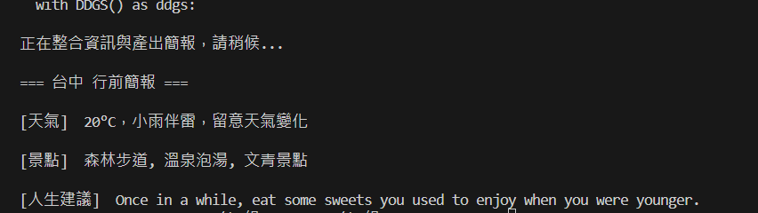

# AI agent 開發分組實作

> 課程：AI agent 開發 — Tool 與 Skill
> 主題： 旅遊前哨站

---

## Agent 功能總覽

> 說明這個 Agent 能做什麼，使用者可以輸入哪些指令

| 使用者輸入   | Agent 行為                             | 負責組員 |
| ------------ | -------------------------------------- | -------- |
| （例：台中） | 呼叫 weather_tool，查詢即時天氣   呼叫 search_tool，搜尋熱門景點   呼叫 advice_tool，取得旅行格言   | 江庭翔 吳東霖 葉書愷 黃元稜 |
---

## 組員與分工

| 姓名 | 負責功能     | 檔案        | 使用的 API |
| ---- | ------------ | ----------- | ---------- |
|   黃元稜   | 查詢即時天氣    | `tools/`  |       wttr.in     |
|   吳東霖   | 搜尋熱門景點    | `tools/`  |     DuckDuckGo Search       |
|   葉書愷  | 取得旅行格言    | `tools/`  |     Advice Slip       |
|   江庭翔   | Skill 整合   | `skills/` | —         |
|   江庭翔   | Agent 主程式 | `main.py` | —         |

---

## 專案架構

範例：

```
├── tools/
│   ├── xxx_tool.py   
│   ├── xxx_tool.py   
│   └── xxx_tool.py  
├── skills/
│   └── xxx_skill.py  
├── main.py        
├── requirements.txt
└── README.md
```

---

## 使用方式

範例：

```bash
python main.py
輸入想去地點
```

---

## 執行結果

> 貼上程式執行的實際範例輸出

```text
$ python main.py
請輸入想去的城市（例如：Tokyo）：台中

正在整合資訊與產出簡報，請稍候...

=== 台中 行前簡報 ===

[天氣]  20°C，舒適宜人，適合戶外活動

[景點]  高美濕地、逢甲夜市、國立自然科學博物館

[人生建議]  Try to do the things that you're incapable of.（去嘗試那些你覺得自己做不到的事吧。）
```

---

## 各功能說明

### [查詢目的地的即時天氣]（負責：黃元稜）

- **Tool 名稱**：weather
- **使用 API**：wttr.in
- **輸入**：城市名稱
- **輸出範例**：20°C，小雨伴雷，留意天氣變化

```python
TOOL = {
    "name": "",
    "description": "",
    "parameters": { ... }
}
```

### [搜尋熱門景點]（負責：吳東霖）

- **Tool 名稱**：search_attractions
- **使用 API**：DuckDuckGo Search
- **輸入**：城市名稱
- **輸出範例**：高美濕地、逢甲夜市、國立自然科學博物館

```python
TOOL = {
    "name": "",
    "description": "",
    "parameters": { ... }
}
```

### [人生格言]（負責：葉書愷）

- **Tool 名稱**：get_travel_advice
- **使用 API**：Advice Slip
- **輸入**：城市名稱
- **輸出範例**：Try to do the things that you're incapable of.（去嘗試那些你覺得自己做不到的事吧。）

```python
TOOL = {
    "name": "",
    "description": "",
    "parameters": { ... }
}
```

### Skill：[旅行前哨站]（負責：江庭翔）

- **組合了哪些 Tool**：weather, search_attractions, get_travel_advice
- **執行順序**：

```
Step 1: 呼叫 weather → 取得天氣
Step 2: 呼叫 search_attractions → 取得景點
Step 3: 呼叫 get_travel_advice → 取得人生格言
Step 4: 組合輸出 → 產生旅行前哨站
```

---

## 心得 
黃元稜 (天氣 Tool)：學習解析 API 資料並簡化為清爽的輸出。
吳東霖 (景點 Tool)：提升了搜尋關鍵字的精確度，產出有感的景點推薦。
葉書愷 (格言 Tool)：體會格言工具為 Agent 帶來的感性互動。
江庭翔 (整合組長)：經驗交流與調整 System Prompt，讓 Tool 完美協作。
### 遇到最難的問題

> 整合期間遇到的bug

- **Tool (工具)**：如同 Agent 的「器官」或「傳感器」。它是單一且具體的能力，用來與外部世界互動（如：抓取天氣、搜尋網頁）。Tool 本身不具備判斷力，只是被動地被呼叫並回傳原始結果。
- **Skill (技能)**：如同 Agent 的「大腦邏輯」或「SOP」。它是透過系統指令 (System Instructions) 定義的任務處理流程。Skill 負責調皮地調度多個 Tool，決定執行順序，並將各項 Tool 回傳的原始資訊（Raw Data）轉化為使用者看得懂、有價值的資訊簡報。


### 如果再加一個功能

> 當地美食
